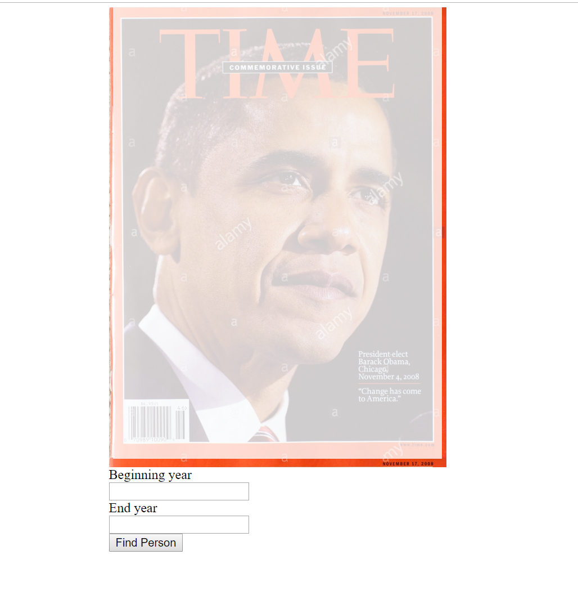
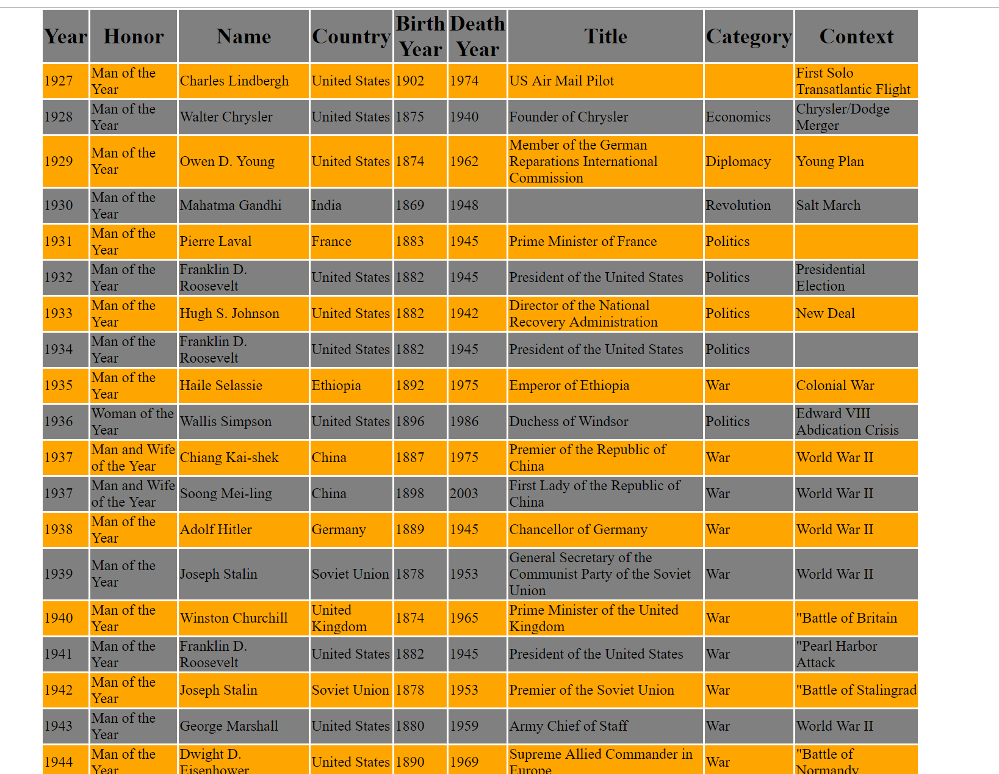

# Lab 11 - MVC & Core
This is a quick site made using MVC and Core. It displays Time's people of the year within a given date range.

## Visual
The index page should look like the following:

The results page should look like the following:

## How to use the program
Open the index page.
Enter the beginning year and end year of the range you want to see Time's people of the year.
Hit the submit button.
The results page will show the people of the year.

## Author
Jimmy Nguyen